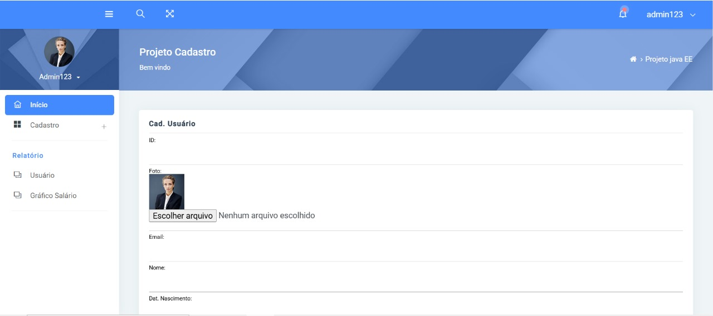

 # CRUD - CADASTRO-USUARIO




O projeto tem como objetivo o aprendizado de conceitos fundamentais da programação web em Java, abordando temas como Servlets para manipulação de requisições (requests) e respostas (responses), além do uso de JDBC para a execução de scripts e operações com banco de dados. Trata-se de uma base essencial para quem deseja se tornar um bom programador Java web.

## Tecnologias utilizadas
**Java:** Linguagem principal utilizada no desenvolvimento da aplicação.

**JDBC:** Utilizado para realizar operações no banco de dados (SELECT, INSERT, DELETE, UPDATE).

**Oracle SQL:** Banco de dados utilizado na persistência das informações.

**JSP** (JavaServer Pages): Responsável pela camada de apresentação e interação com o usuário.

**Servlets:** Controlam o fluxo de requisições entre o front-end e o back-end.

**Bootstrap:** Framework CSS usado para estilização e responsividade das páginas.

**JavaScript:** Aplicado para interações dinâmicas, como limpeza de formulários.

**AJAX:** Permite enviar e receber dados do servidor sem recarregar a página.

**JasperReports:** Ferramenta utilizada para geração de relatórios em PDF.

**Chart.js:** Biblioteca usada para exibir gráficos dinâmicos na interface.

### Funcionalidades do Projeto.

-  **Conexão com Banco de Dados**<br>
    Estabelecimento de conexão com banco de dados utilizando JDBC.
   
-  **Execução de Scripts com JDBC**<br>
    Operações de CRUD (SELECT, INSERT, DELETE) diretamente com o banco de dados.
   <br>
-  **Login com Autenticação de Usuário**<br>
    Sistema de login com validação de credenciais no banco de dados.
   <br>
- **Controle de Funcionalidade por Perfil de Acesso**<br>
Acesso restrito às funcionalidades com base nos perfis:<br>
   - ADMIN
   - SECRETARIO
   - AUXILIAR

- **Gerenciamento de Sessão**<br>
Manutenção da sessão do usuário logado, com controle de acesso às páginas protegidas.<br>
-  **Cadastro de Usuário com Diversos Campos**<br>
Inclusão de informações completas no cadastro, incluindo:
      - **Dados básicos:** ID, NOME, EMAIL, LOGIN, SENHA

     - **Controle de acesso:** USER_ADMIN, USUARIO_ID, PERFIL

     - **Informações pessoais:** SEXO, DATA_NASCIMENTO, RENDA_MENSAL, CPF

    - **Endereço:** CEP, LOGRADOURO, BAIRRO, LOCALIDADE, UF, NUMERO
    - **Foto:** FOTOUSER, EXTENSAOFOTOUSER
 
-  **Listagem de Usuários**<br>
Exibição dos usuários cadastrados em formato de tabela.

-  **Pesquisa de Usuário**<br>
Filtro para busca de usuários com base em nome campos.

-  **Cadastro e Listagem de Telefones por Usuário**<br>
Associação de múltiplos telefones a um único usuário, com possibilidade de listar e deletar.

-  **Geração de Relatórios**<br>
Relatórios gerais de usuários.

-  **Geração de Relatórios com Filtro por Data de Nascimento**<br>
Relatórios personalizados a partir data inicial e final definidos pelo usuário.

-  **Download de Relatório em PDF com JasperReports**<br>
Exportação dos relatórios em formato PDF utilizando a biblioteca JasperReports.

-  **Geração de Gráficos com Chart.js**<br>
Visualização de dados por meio de gráficos dinâmicos e interativos.


## 💻 Pré-requisitos

Antes de começar, verifique se você atendeu aos seguintes requisitos:

- Você instalou a versão mais recente de `<linguagem / dependência / requeridos>`
- Você tem uma máquina `<Windows / Linux / Mac>`. Indique qual sistema operacional é compatível / não compatível.
- Você leu `<guia / link / documentação_relacionada_ao_projeto>`.

## 🚀 Instalando <nome_do_projeto>

Para instalar o <nome_do_projeto>, siga estas etapas:

Linux e macOS:

```
<comando_de_instalação>
```

Windows:

```
<comando_de_instalação>
```

## ☕ Usando <nome_do_projeto>

Para usar <nome_do_projeto>, siga estas etapas:

```
<exemplo_de_uso>
```

Adicione comandos de execução e exemplos que você acha que os usuários acharão úteis. Forneça uma referência de opções para pontos de bônus!

## 📫 Contribuindo para <nome_do_projeto>

Para contribuir com <nome_do_projeto>, siga estas etapas:

1. Bifurque este repositório.
2. Crie um branch: `git checkout -b <nome_branch>`.
3. Faça suas alterações e confirme-as: `git commit -m '<mensagem_commit>'`
4. Envie para o branch original: `git push origin <nome_do_projeto> / <local>`
5. Crie a solicitação de pull.

Como alternativa, consulte a documentação do GitHub em [como criar uma solicitação pull](https://help.github.com/en/github/collaborating-with-issues-and-pull-requests/creating-a-pull-request).

## 🤝 Colaboradores

Agradecemos às seguintes pessoas que contribuíram para este projeto:

<table>
  <tr>
    <td align="center">
      <a href="#" title="defina o título do link">
        <br>
        <sub>
          <b>Iuri Silva</b>
        </sub>
      </a>
    </td>
    <td align="center">
      <a href="#" title="defina o título do link">
        <br>
        <sub>
          <b>Mark Zuckerberg</b>
        </sub>
      </a>
    </td>
    <td align="center">
      <a href="#" title="defina o título do link">
        <br>
        <sub>
          <b>Steve Jobs</b>
        </sub>
      </a>
    </td>
  </tr>
</table>

## 😄 Seja um dos contribuidores

Quer fazer parte desse projeto? Clique [AQUI](CONTRIBUTING.md) e leia como contribuir.

## 📝 Licença

Esse projeto está sob licença. Veja o arquivo [LICENÇA](LICENSE.md) para mais detalhes.
