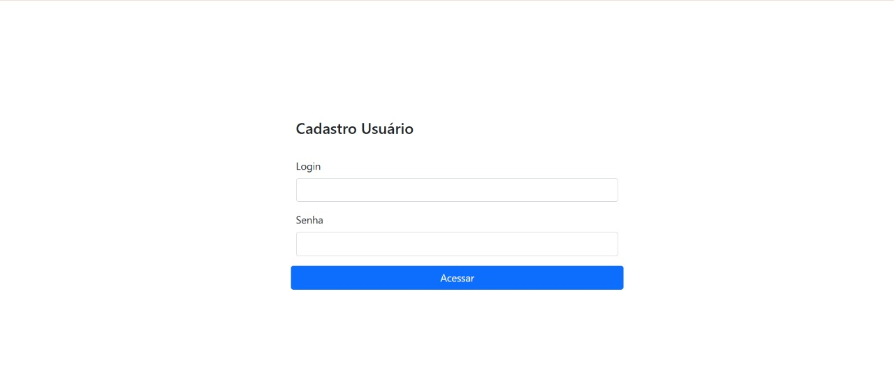

 # CRUD - CADASTRO-USUÁRIO

O projeto tem como objetivo o aprendizado de conceitos fundamentais da programação web em Java, abordando temas como Servlets para manipulação de requisições (requests) e respostas (responses), além do uso de JDBC para a execução de scripts e operações com banco de dados. Trata-se de uma base essencial para quem deseja se tornar um bom programador Java web.

## Tecnologias utilizadas
**Java:** Linguagem principal utilizada no desenvolvimento da aplicação.

**JDBC:** Utilizado para realizar operações no banco de dados (SELECT, INSERT, DELETE, UPDATE).

**Oracle SQL:** Banco de dados utilizado na persistência das informações.

**JSP** (JavaServer Pages): Responsável pela camada de apresentação e interação com o usuário.

**Servlets:** Controlam o fluxo de requisições entre o front-end e o back-end.

**Bootstrap:** Framework CSS usado para estilização e responsividade das páginas.

**JavaScript:** Aplicado para interações dinâmicas, como limpeza de formulários.

**AJAX:** Permite enviar e receber dados do servidor sem recarregar a página.

**JasperReports:** Ferramenta utilizada para geração de relatórios em PDF.

**Chart.js:** Biblioteca usada para exibir gráficos dinâmicos na interface.

### Funcionalidades do Projeto.

-  **Conexão com Banco de Dados** 
    Estabelecimento de conexão com banco de dados utilizando JDBC.
   
-  **Execução de Scripts com JDBC** 
    Operações de CRUD (SELECT, INSERT, DELETE) diretamente com o banco de dados.
    
-  **Login com Autenticação de Usuário** 
    Sistema de login com validação de credenciais no banco de dados.
    
- **Controle de Funcionalidade por Perfil de Acesso** 
Acesso restrito às funcionalidades com base nos perfis: 
   - ADMIN
   - SECRETARIO
   - AUXILIAR

- **Gerenciamento de Sessão** 
Manutenção da sessão do usuário logado, com controle de acesso às páginas protegidas. 
-  **Cadastro de Usuário com Diversos Campos** 
Inclusão de informações completas no cadastro, incluindo:
      - **Dados básicos:** ID, NOME, EMAIL, LOGIN, SENHA

     - **Controle de acesso:** USER_ADMIN, USUARIO_ID, PERFIL

     - **Informações pessoais:** SEXO, DATA_NASCIMENTO, RENDA_MENSAL, CPF

    - **Endereço:** CEP, LOGRADOURO, BAIRRO, LOCALIDADE, UF, NUMERO
    - **Foto:** FOTOUSER, EXTENSAOFOTOUSER
 
-  **Listagem de Usuários** 
Exibição dos usuários cadastrados em formato de tabela.

-  **Pesquisa de Usuário** 
Filtro para busca de usuários com base em nome campos.

-  **Cadastro e Listagem de Telefones por Usuário** 
Associação de múltiplos telefones a um único usuário, com possibilidade de listar e deletar.

-  **Geração de Relatórios** 
Relatórios gerais de usuários.

-  **Geração de Relatórios com Filtro por Data de Nascimento** 
Relatórios personalizados a partir data inicial e final definidos pelo usuário.

-  **Download de Relatório em PDF com JasperReports** 
Exportação dos relatórios em formato PDF utilizando a biblioteca JasperReports.

-  **Geração de Gráficos com Chart.js** 
Visualização de dados por meio de gráficos dinâmicos e interativos.

### TELAS DO PROJETO

  
   
  
 
 
 
 

